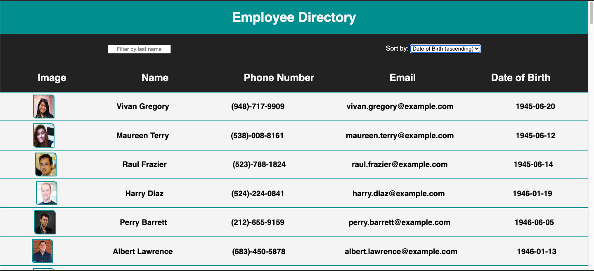
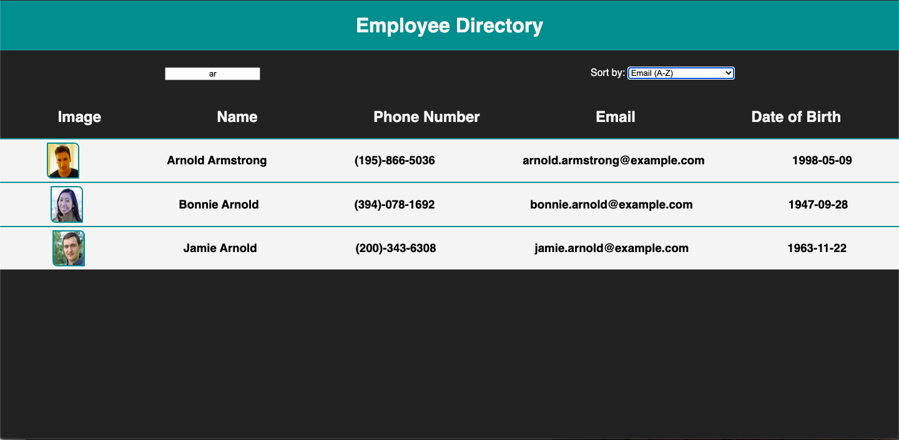

# Employee Directory
React app that dynamically displays a table of employee information as components

[](https://opensource.org/licenses/MIT)
  
## Description
Employee Directory is a front-end React app that displays a table of dynamically generated employee information and allows the user to filter and sort through the directory. The app uses the node package Axios to make a call to a 3rd party API called Random User Generator, and then uses array methods to manipulate state and update the employee table via user interaction with an input and dropdown.

## Table of Contents
* [Installation](#Installation)
* [Usage](#Usage)
* [Images](#Images)
* [Contributing](#Contributing)
* [License](#License)
* [Questions](#Questions)

## Installation
* Clone the repo [here](http://www.github.com/jameygronewald/employeeDirectory) and run  ```npm install```
* Once you have repo cloned and dependencies installed, run  ```npm start``` in the command line to start server on localhost:3000.

## Usage
1. View the deployed app [here](https://jameygronewald.github.io/employeeDirectory/).

## Images

### Screenshots



## Contributing
I am the sole contributor on this project.

## License
MIT License

Copyright (c) [2020] [Jamey Gronewald]

Permission is hereby granted, free of charge, to any person obtaining a copy
of this software and associated documentation files (the "Software"), to deal
in the Software without restriction, including without limitation the rights
to use, copy, modify, merge, publish, distribute, sublicense, and/or sell
copies of the Software, and to permit persons to whom the Software is
furnished to do so, subject to the following conditions:

The above copyright notice and this permission notice shall be included in all
copies or substantial portions of the Software.

THE SOFTWARE IS PROVIDED "AS IS", WITHOUT WARRANTY OF ANY KIND, EXPRESS OR
IMPLIED, INCLUDING BUT NOT LIMITED TO THE WARRANTIES OF MERCHANTABILITY,
FITNESS FOR A PARTICULAR PURPOSE AND NONINFRINGEMENT. IN NO EVENT SHALL THE
AUTHORS OR COPYRIGHT HOLDERS BE LIABLE FOR ANY CLAIM, DAMAGES OR OTHER
LIABILITY, WHETHER IN AN ACTION OF CONTRACT, TORT OR OTHERWISE, ARISING FROM,
OUT OF OR IN CONNECTION WITH THE SOFTWARE OR THE USE OR OTHER DEALINGS IN THE
SOFTWARE.

## Questions
Please direct any questions to jrgronewald@gmail.com, or visit the GitHub repository at https://github.com/jameygronewald/employeeTracker.